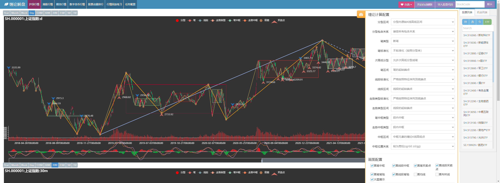
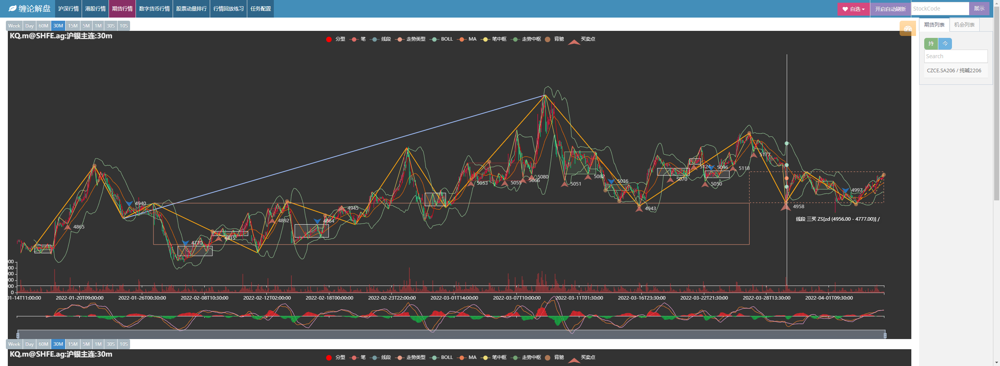
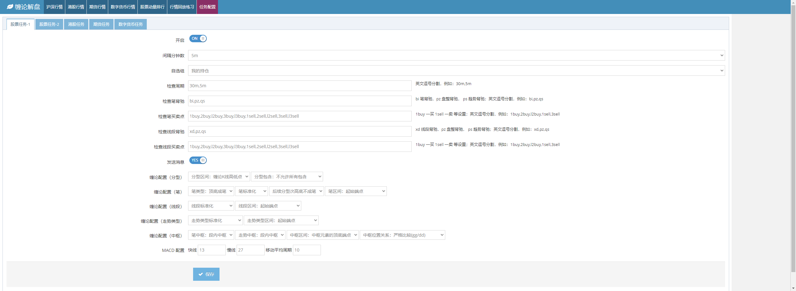

# 缠论市场 WEB 分析工具

---

基于缠论的市场行情分析工具

[Github 地址](https://github.com/yijixiuxin/chanlun-pro)

[Gitee 地址](https://gitee.com/wang-student/chanlun-pro)

[在线 Demo 展示](http://www.chanlun-trader.com/)  
_在线Demo只做上证指数的缠论示例_

**项目的核心 cl.py 缠论计算，需要授权许可文件才可运行，加微信好友可免费获取30天使用授权。**

[更新日志](UPDATE.md)

**项目的核心 cl.py 缠论计算，需要授权许可文件才可运行，加微信好友可免费获取30天使用授权。**

[更新日志](UPDATE.md)

### 项目当前功能

* 缠论图表展示(沪深股市、港股、美股、期货、数字货币)
* 行情数据下载（沪深股市、港股、美股、期货、数字货币）
* 行情监控（背驰、买卖点）
* 行情回放练习（基于本地行情数据）
* 自定义缠论策略进行回测
* 实盘策略交易
* VNPY 策略与实盘支持

### 项目中的计算方法

缠论数据的计算，采用逐K方式进行计算，根据当前K线变化，计算并合并缠论K线，再计算分型、笔、线段、中枢、走势类型、背驰、买卖点数据；

再根据下一根K线数据，更新以上缠论数据；

如已经是形成并确认的分型、笔、线段、中枢、走势类型等，后续无特殊情况（标准化），则不会进行变更。

如上，程序会给出当下的一个背驰或买卖点信息，至于后续行情如何走，有可能确认，也有可能继续延续，最终背驰或买卖点消失；

这种情况就需要通过其他的辅助加以判断，如均线、布林线等指标，也可以看小级别的走势进行判断，以此来增加成功的概率。

这种计算方式，可以很方便实现增量更新，process_klines 方法可以一直喂数据，内部会判断，已处理的不会重新计算，新K线会重复以上的计算步骤；

在进行策略回测的时候，采用以上的增量计算，可以大大缩减计算时间，从而提升回测的效率。

### 特别说明

要想愉快的享用本项目，需要有两个前提：

> 了解缠论的 笔、线段、中枢、级别 等基础知识；
>
> 编程基础，Python 要能写简单的程序，Linux也懂一些就更好了；

**如满足以上条件，再考虑是否需要进行购买**

项目为个人开发与维护，精力有限，不太可能服务太多用户，所以定价为 1800 元/每年；   
随着人数增加，保留后期调整价格的权利；

### 感兴趣可加微信进行了解

**加好友可免费获取30天使用授权**

> 请先阅读安装文档，确保自己能够正常安装后，在添加微信好友；
>
> 如需免费30天试用，需通过 pyarmor hdinfo 命令获取默认网卡地址后，发送给作者获取授权文件

### 实际运行效果展示

**沪深股票行情图表页面**

**期货市场行情图表页面**

**数字货币行情图表页面**

**历史行情回放，根据数据库中历史行情数据，逐bar回放展示行情，可用于观察缠论计算与练习买卖操作**

**可按照市场中的自选列表，设置缠论数据指标的监控信号（背驰、买卖点信息）**

**通过 Jupyterlab 进行策略回测，图表展示回测结果；并展示回测标的历史行情，并标注买卖订单，从而进行策略优化**

**项目的回测没有资金与仓位管理，每次下单固定金额10W，主要用于测试策略信号的胜率与盈亏比**

