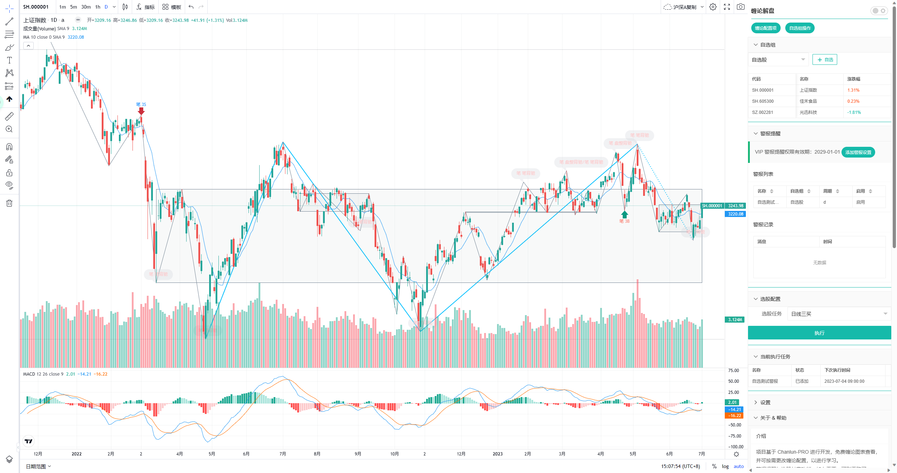

# 缠论解盘 - 善缘版 Windows

---

### 善缘版是基于 Chanlun-Pro 项目开发的免费桌面程序；

### 最新版本：V1.0.3

_更新时间：2023-02-01_

扫码入QQ群，在群文件中进行下载使用；

行情数据只包括沪深A股市场；

缠论计算与图表展示只支持固定配置，不可更改；

可添加删除自选，没有自选组功能；（双击可增加/删除自选）

内置线段三买点选股功能（日线、30分钟），需要手动触发执行；

初次执行三买选股，需要获取行情数据并进行计算，根据电脑配置，可能需要3-4小时，后续在执行，有缓存的原因，大概几十分钟就可以完成；

线段三买选股每日只能执行一次，建议15点收盘后执行；

### 更新日志

#### V1.0.3 (2023-02-01)

* 缠论计算优化
* 升级 pyecharts 库版本
* 新增 30分钟线段三买选股
* 优化项目，Bug修复

#### V1.0.2 （2023-01-03）

* 缠论计算优化，Bug 修复

#### V1.0.1 （2022-12-02）

* 缠论计算优化，Bug 修复

### 程序展示

> 沪深A股行情

> 三买选股行情

