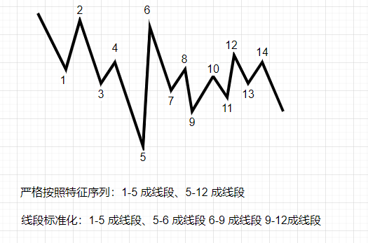

## 缠论配置项说明

---

### K线类型 (kline_type)

* 默认K线 （kline_default）
* 平均K线 （kline_heikin_ashi）

> 平均K线 与原始K线有差异，使用 平均K线 数据，后续计算的 macd 指标使用处理后的 收盘价计算
> 
> 平均K线说明 ： https://support.futunn.com/topic590

### 分型区间 （fx_qj）

* 分型内原始K线高低区间（fx_qj_k）
* 分型内缠论K线高低区间（fx_qj_ck）

### 分型包含关系（fx_bh）

* 接受所有包含关系（fx_bh_yes）
* 不允许所有包含关系（fx_bh_no）
* 顶不可以在底中（fx_bh_dingdi）
* 底不可以在顶中（fx_bh_diding）
* 不允许前分型包含后分型（fx_bh_no_qbh）
* 不允许后分型包含前分型（fx_bh_no_hbq）

### 笔类型（bi_type）

* 老笔（bi_type_old）
* 新笔（bi_type_new）
* 简单笔（bi_type_jdb）
* 顶底成笔（bi_type_dd）

> 老笔：顶底分型不能共用缠论K线，并且分型之间至少有一根独立的缠论K线
>
> 新笔：顶底分型不能共用缠论K线，并且分型之间至少有5跟原始K线
>
> 简单笔：顶底分型，至少5跟原始K线，即可成笔
>
> 顶底成笔：只要出现顶底分型，就可成笔

### 笔标准化（bi_bzh）

* 笔标准化（bi_bhz_yes）
* 笔不标准化（bi_bhz_no）

> 标准化，将笔画在实际的高低点

### 次高底分型（bi_fx_cgd）

* 允许次高低分型成笔（bi_fx_cgd_yes）
* 不允许次高低分型成笔（bi_fx_cgd_no）

### 笔区间（bi_qj）

* 笔的起始端点（bi_qj_dd）
* 笔内原始K线最高最低（bi_qj_k）
* 笔内缠论K线最高最低（bi_qj_ck）

> 计算线段时，用到笔计算特征序列，笔的高低点根据这里设置获取，会影响到线段的特征序列，从而影响到线段的计算

### 线段标准化（xd_bzh）

* 严格按照特征序列顶底端点（xd_bzh_no）
* 标准化线段画在高低端点（xd_bzh_yes）

### 线段区间（xd_qj）

* 线段的起始端点（xd_qj_dd）
* 线段内缠论K线高低点（xd_qj_ck）
* 线段内原始K线高低点（xd_qj_k）

> 同笔区间

### 走势段标准化（zsd_bzh）

* 严格按照特征序列顶底端点（zsd_bzh_no）
* 标准化线段画在高低端点（zsd_bzh_yes）

> 同线段标准化

### 走势段区间（zsd_qj）

* 线段的起始端点（zsd_qj_dd）
* 线段内缠论K线高低点（zsd_qj_ck）
* 线段内原始K线高低点（zsd_qj_k）

> 同笔/线段区间

### 笔中枢类型（zs_bi_type） / 线段中枢（zs_xd_type）

* 标准中枢（zs_type_bz）
* 段内中枢（zs_type_dn）
* 方向中枢（zs_type_fx）

> 标准中枢：中枢会根据前三笔重合区间，一直延续，直到出现三类买卖点结束
>
> 段内中枢：在新的线段出现前，同标准中枢，如出现新的线段，从线段的起始位置，重新计算新的中枢
>
> 方向中枢：严格按照中枢进入离开笔，可明确中枢方向

### 中枢区间（zs_qj）

* 中枢元素的顶底端点（zs_qj_dd）
* 中枢元素的缠论K线高低点（zs_qj_ck）
* 中枢元素的原始K线高低点（zs_qj_k）

> 计算中枢 zg/zd/gg/dd （中枢高点、中枢低点）的依据

### 中枢位置关系（zs_wzgx）

* 宽松比较(zg/zd) （zs_wzgx_zgd）
* 较为宽松(zg/dd zd/gg) （zs_wzgx_zggdd）
* 严格比较(gg/dd) （zs_wzgx_gd）

> 判断两个中枢是否有重复，以此判断是否形成趋势
>
> 宽松比较(zg/zd)：两个中枢的 zg、zd 进行比较
>
> 较为宽松(zg/dd zd/gg) ：当前中枢的 zg/zd 与上一个中枢的 gg/dd 进行比较
>
> 严格比较(gg/dd)：两个中枢的 gg、dd 进行比较

